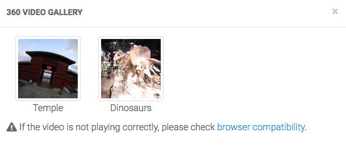
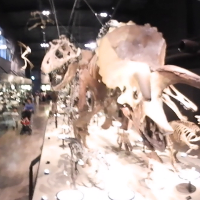
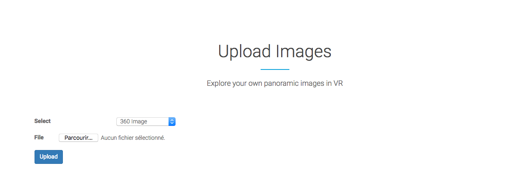

# WebVR site

This document describes how the IVS WebVR page works.

WebVR is an open technology making it possible to experience VR in your web browser. Rather than installing a VR application, WebVR make it easier for everyone to get into VR experiences. All you need is a VR headset such as the affordable Google Cardboard and a compatible browser.

As for the IVS lab, this section of the website will allow users to immerse into 360 images and videos.

The WebVR section is accessible on http://www.ivs.auckland.ac.nz/webvr/

---
**Note**

Currently the upload directory `upload/` used for the WebVR site is not writable for normal users. For that reason the media files are temporarily relocated in `/quick_stereo/upload/webvr/`.

Please make sure for the future to give permissions to the `upload/` directory and update all the links in the `.php` files for a cleaner architecture.

---

## Getting started

### WebVR & A-Frame

**Compatibility**

Some of the WebVR may not work due to compatibility issues. Please ensure your web browser is compatible on the official A-frame support:
https://aframe.io/docs/0.8.0/introduction/vr-headsets-and-webvr-browsers.html#which-browsers-does-a-frame-support

### Viewers

The index page gives access to different panoramic viewers displaying the images and videos contained in the `gallery/` folder.

If you want to add a new image or video, copy the file directly on the server in the specified directories. However it is also possible for external users to upload a temporary file and see it in the viewers. Further details are provided in the **Upload Images** section.

#### 360 viewer
**->** `360viewer.php`

This is the most basic viewer. It displays panoramic images. The images are automatically loaded from the directory `gallery/360images/`.

A default image is displayed in 360. The other pictures contained in the gallery directory are displayed in thumbnails.

The current thumbnails layout is a line, but if there are two many images, you can change it by modifying the  `<a-entity id="links" layout="..." >` tag, for example by choosing a box layout and specifying the number of columns. See https://www.npmjs.com/package/aframe-layout-component for further details. Ideally the layout should be dynamically modified based on the number of images.

To change the main 360 image displayed, hover or click on a thumbnail.

#### 360 stereo viewer
**->** `360stereoViewer.php`

This viewer allows to visualize stereo images (left and right, to recreate 3D). A default pair of images `left.jpg` and `right.jpg` contained in the `gallery/360stereoImages/` is displayed. If you have more samples, you may want to create a modal gallery as used for the **360 video** viewer.

You can also render another pair of images by using the upload feature detailed in the **Upload Images** section.

#### 360 video
**->** `360video.php`

This viewer can be used to watch 360 videos. Clicking on the viewer icon will show a pop-up containing a video gallery. Click on a thumbnail to enter the viewer.



360 videos playing might not work depending on the device and browser you use. See the **Compatibility** section for further information.

As the 360 video files are quite heavy, uploading video on the server is not possible yet. If you want to add a new video, copy the file in the `gallery/360videos/` folder and add a linkable thumbnail in the appropriate location in the `index.php` file, as in this example:
```
<div id="360videoModal" ...>
...
            <!-- Dinosaurs museum video -->
               <div class="col-sm-6 col-md-3">
                   <a href="360video.php?video=dinosaurs">
                       
                   </a>
                   <div class="caption text-center">
                       <p>Dinosaurs</p>
                   </div>

               </div>
...
</div>
```

#### 360 stereo video
**->** `360stereoVideo.php`

The viewer can render 360 stereo videos. It was tested with a `.webm` 3D video. However, there is no 360 stereo video sample in the lab at the moment.

For further details check this tutorial:
https://github.com/oscarmarinmiro/aframe-stereo-component

### Upload Images

At the end of the webVR main page, there is a **Upload Images** section. You can upload a 360 image and render it in the corresponding viewers.



Select the `360 Image` option to upload a simple panoramic image. Then click on `Upload`. If the upload was successful, you will be redirected on the 360 viewer with your image displayed.

**Upload directory**

The uploaded files are relocated in the `upload/` directory (or another directory if it is not writable, as explained earlier) and renamed accordingly:
- `panorama.jpg` for uploaded 360 images
- `left.jpg` for left stereo image
- `right.jpg` for right stereo image

To display these uploaded files instead of the gallery files, the viewers check the `upload` GET parameter value  as in this URL:
http://www.ivs.auckland.ac.nz/webvr/360viewer?upload=true


If this parameter is true, then the uploaded file is displayed. If it is not true or not specified, the default gallery pictures will be displayed.

### VR menu

Alternatively, you can use the VR menu to navigate between the viewers. Click on the `Get started` button, enter VR mode and choose one of the viewers.
